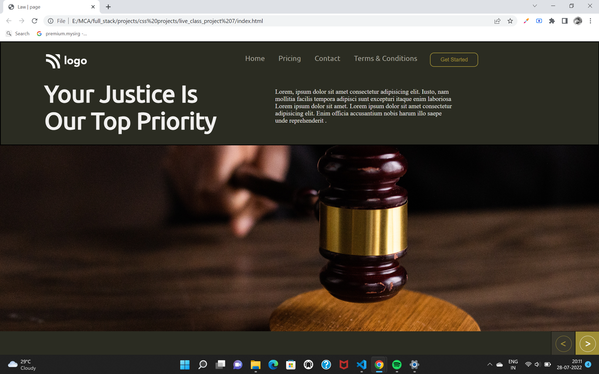

# Rohan Kaushik's project

This is my 7th Template and now I am moving towards more perfection 

## What I have learnt in this Project
   - Background perfection I learnt 
   - I used flexbox faced difficulties 
   - how to use the Fontawsome website to use icons
   - give a attractive look to icon as you can see in bottom right there are two icons which i have covered with circle and give a square background 

## Time Spent on this project

- This project tooks my 4 hrs ...

